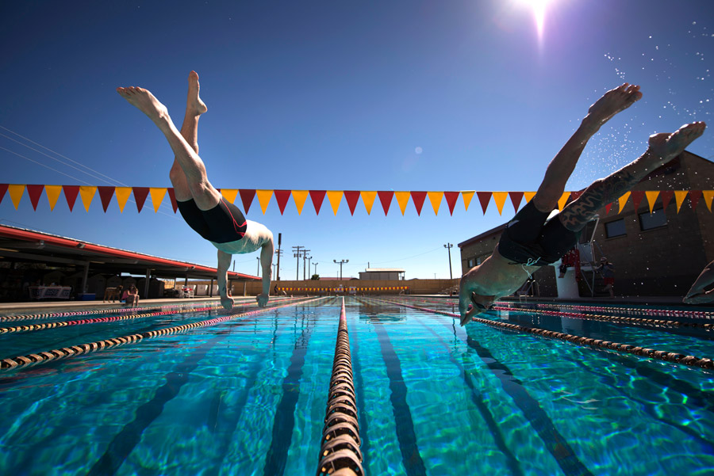
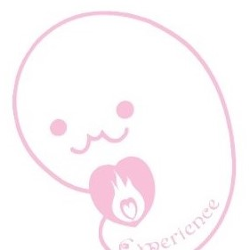

#SWIM EXPERIENCE HOME PAGE
<!DOCTYPE html>
<html lang="ja">
<head>
<meta charset="UTF-8">
<title>SWIM EXPERIENCE HOME PAGE</title>
<meta name="viewport" content="width=device-width, initial-scale=1">
<meta name="description" content="競泳が速くなりたい選手のためのホームページです">
<link rel="stylesheet" href="main_style.css"> <link href="https://cdnjs.cloudflare.com/ajax/libs/lightbox2/2.7.1/css/lightbox.css" rel="stylesheet">
<link rel="stylesheet" href="https://cdnjs.cloudflare.com/ajax/libs/font-awesome/5.15.4/css/all.min.css"> </head>

<body>

<header>
  
</header>

<section class="hero">
  
 <h2>Life is short, so I want to swim faster.</h2>
    <small>人生は短いらしい。そうなら速く泳ぎたい</small>
  

   </section>

<main>

  
 <h1 class="white">
      <marquee behavior="scroll" direction="left">
        スイム・イクスピリエンスとは   直訳すると、【競泳を体験・実感する】の意味です。
        スイム・イクスピリエンスの活動を体験してもらい、選手の描いた理想通りに、上手く、速くなる実感を持つサポートをいたします
      </marquee>
    </h1>
  

  

    <nav>
      <ul>
        <li><a href="index.html">ホームHome</a></li> <li><a href="#">スイム・イクスピリエンスDrop Down</a>
          <ul>
            <li><a href="#">活動のきっかけ</a></li>
            <li><a href="#">こんな悩みを持つ競泳選手は、ぜひご相談ください</a></li>
            <li><a href="#">主な活動内容</a></li>
            <li><a href="#">エクスペリエンスちゃんとは</a></li>
            <li><a href="#">スイム・イクスピリエンスちゃんとは</a></li>
            <li><a href="#">栃木のプールに潜む妖怪 バタフライジジイとは</a></li>
            <li><a href="#">宇都宮スイムマスターズ連合<mark>（準備中）</mark></a></li>
            <li><a href="#">お問い合わせ先</a></li>
          </ul>
        </li>
      </ul>
    </nav>
  

    <section>
      <h2>スイム・イクスピリエンスの活動と内容</h2>
      <ul>
        <li>2025年7月から準備し、2026年より本格活動を計画中。</li>
        <li>現在の活動は、「主な活動内容」の中の、<strong>①競泳選手傾向診断</strong>
        <strong>②レース動画解析</strong>の２つのみ、活動中です。</li>
      </ul>
      
その他の活動においては、準備が整い次第、順次発信を行います。

      
スイム・イクスピリエンスの活動情報は、インスタグラムで閲覧可能です（後日、インスタＱＲを載せる）

      

        

          <figure></figure>
          

            <h4><strong>活動のきっかけ</strong></h4>
            
●「競泳、活動を通じた人格形成」 
            ●「戦略的な考えを持って、レースから練習まで、選手自身が構築できる」 
            ●「競泳、スポーツを愛する選手であれば、障害に関係なくサポートする」 
            を理念として、競泳、スポーツを愛するが、悩みのある選手たちに、 
            スイムイクスピリエンスの経験・体験を通じて 
            競泳選手としてだけでなく、人間として成長してほしいとの願いから名づけました。

          

          NEW 

        

          <figure></figure>
          

            <h4><strong>こんな悩みを持つ競泳選手は、ぜひご相談ください</strong></h4>
            
私は、他の選手と一緒にスタートしているのに、なんであれだけ差が付いているのか？

            
私は、いつ、どのタイミングで、１番タイムが伸びるのだろうか？

            
今以上は頭打ちで、これ以上タイムが縮まらないのか？

            
成人、おじさん、おばさんは、もう何をやっても水泳が上手に、速くなれないのか？

            
水泳を続けているのに、なぜ私は、スイマー体型にならないのか？

            

              <a href="#" class="button">
                こんなお悩みの選手はクリック
              </a>
            

          

          

        
 
 <h4><strong>スイム・イクスピリエンスの主な活動内容</strong></h4>
            
<strong>①競泳選手傾向診断</strong>

            
 競泳選手に必要な要素を数値化して、選手自身の得手不得手を

            
 <strong><mark>把握・見える化</mark></strong>することで、<strong><mark>今後の練習や、モチベーションに反映</mark></strong>できます

            

              <a href="#" class="button"> 受診したい選手はクリック
              </a>
            

          

          

        
 
 
<strong>②レース動画解析</strong>

            
大会等で撮影された選手のレース動画を持ち込んでいただき

            
スイム・イクスピリエンスが、<strong><mark>客観的解析と選手の良い点</mark></strong>

            
<strong><mark>今後のレースに生かす改善点をアドバイス</mark></strong>します

            

              <a href="#" class="button">
                依頼したい選手はクリック
              </a>
            

            
<strong>③講習会<mark>（準備中）</mark></strong>

            
<strong>④練習会<mark>（準備中）</mark></strong>

          

          UP
        

        

          <figure></figure>
          

            <h4>エクスペリエンスちゃんとは？</h4>
            
宇都宮市宝木町にある美容室 ヘアクリエイション エクスペリエンスのキャラクター。 
            スイム・イクスピリエンスちゃんとは、生き別れた弟。そら豆の形をした胎児です。

            
もっと詳しく知りたい方はこちら url:<a href="http://experience52.web.fc2.com/" target="_blank">http://experience52.web.fc2.com/</a>

          

        

        

          <figure></figure>
          

            <h4>スイム・イクスピリエンスちゃんとは？</h4>
            
エクスペリエンスちゃんとは、生き別れた兄弟でお兄ちゃん。

            
上三川町の本郷地区の小学校に通う、見た目は胎児だが、小学４年生。

            
たまたま行ったプールで、バタフライジジイ（詳細は、次の事項ご確認ください）

            
に導かれて泳ぐうちに、水泳の楽しさが理解出来てきた。

            
導かれてからは、泳ぐ力と速さが上がっていることを実感出来ているが、
            いざレースになると自分をコントロールしきれず、結果につながっていない。

            
また、導かれた影響なのかは不明だが、きちんと着用して泳いでも、泳ぎ終わるとゴーグルが吊り上がるようになった。

            
(後ほど画像差し込み)

            
スイムイクスピリエンスちゃんの座右の銘は、 
            「嘘をつかない。人に迷惑をかけない。お友達には思いやりを持って接する」。

          

        

        

          <figure></figure>
          

            <h4><strong>栃木のプールに潜む妖怪 バタフライジジイ（通称：バタジイ）</strong></h4>
            
言い伝えによると、小学1年生からスイミングに通い、栃木県競泳初の全国大会優勝者になったことで、
            腰に故障を抱えながらも、今もなお、練習を続けて大会にも出場しているという。
            バタジイは、ある時から筋力トレーニングを取り入れ、筋トレの素晴らしさに目覚めた。しかしタンパク質の多量摂取の影響なのか、見た目と泳ぎがジジイではない＝妖怪化した と伝わる。
            （ある情報筋から入手した、バタジイが全国優勝した時のバタフライ画像）

            
主に上三川町で目撃例があるが、栃木県以外でも、埼玉県や東京都のプールで出没したとの情報があり、

            
子どもと、スポーツに真剣に向き合っている人には優しいとの情報もあるが、バタジイへのリスペクトを行わず、逆に攻撃したり、身の程を知らないオトナ相手には、
            バタジイ必殺のバタフライアームで、首にラリアート攻撃をしてくる危険性が高い。
            もし遭遇したら近寄らず、その泳ぎから目を離さずに、そっと後ろ向きの状態でプールやレーンから離れるのが命を守る方法である。

            
好物は、上三川町のらー麺 藤原家のつけ麺と、抹茶スイーツ全般で、藤原家と、和菓子茶屋 武平作で、プール以外の場でも多数の出没情報がある。
            基本、バタフライを速く泳ぐことに全勢力を注いでいる妖怪のため、プール以外で遭遇するのはレアなため、遭遇した人間には幸せが訪れるという幸運の妖怪でもある。（民明書房刊）

            
バタフライジジイの出現・目撃・出没情報はインスタグラムで閲覧可能です（後日、インスタＱＲを載せる）

          

        

        <h4>お問い合わせ先</h4>
        <form action="mailform.php" method="post"> 
お名前:<input type="text" name="name" id="name" required>
 
性別<input type="radio" name="sex" value="男" required>男<input type="radio" name="sex" value="女" required>女
 
メールアドレス:<input type="email" name="email" required>
 
メッセージ

          
<textarea name="message" cols="50" rows="5" required="required"></textarea>
 
<input type="submit" value="送信する">
 </form>

      
</section>
  
</main>

<footer>
  
 
    <nav class="footer-nav"> <ul>
        <li><a href="index.html#about">活動のきっかけ</a></li>
        <li><a href="index.html#about">こんな悩みを持つ競泳選手は、ぜひご相談ください</a></li> <li><a href="index.html#about">活動内容</a></li> <li><a href="index.html#about">エクスペリエンスちゃんとは</a></li>
        <li><a href="index.html#about">スイム・エクスペリエンスちゃんとは</a></li>
        <li><a href="index.html#about">栃木のプールに潜む妖怪 バタフライジジイ</a></li>
        <li><a href="index.html#about">宇都宮スイムマスターズ連合について（準備中）</a></li>
        <li><a href="index.html#about">お問い合わせ先</a></li>
      </ul>
    </nav>
    
&copy; Copyright 2025/07/14 Y. Omori
 

  

    

      

      
代表メールアドレス：swim exp@outlook.jp お急ぎの方は4yoomori@gmail.com 
      受付：基本、メール、または問い合わせフォームでの受付になります

      <ul class="sns1-parts">
        <li><a href="#"><i class="fab fa-line"></i></a></li>
        <li><a href="#"><i class="fab fa-youtube"></i></a></li>
        <li><a href="#"><i class="fab fa-instagram"></i></a></li>
      </ul>
    

</footer>

<a href="#"><i class="fas fa-angle-double-up"></i></a>

</body>
</html>

